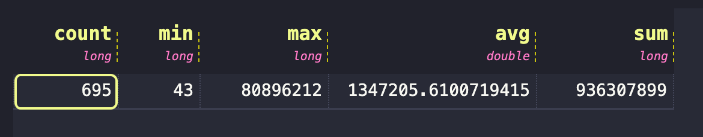

# Fluvio DeepCausality Example Project

## ⚡ Status: **Progressing...**

This project is early stage and under **active development** meaning things break overnight. 

### 👉 **Fluvio**

Fluvio is an open-source data streaming platform with in-flight computation capabilities to aggregate, correlate, and transform data records in real-time as they move through the network. Read more on the [Fluvio website](https://www.fluvio.io). 

### 👉 **DeepCausality**

DeepCausality is a hyper-geometric computational causality library that enables fast and deterministic context-aware reasoning over complex multi-stage causality models. Deep Causality adds only minimal overhead and thus is suitable for real-time applications. Read more on the [DeepCausality website](https://www.deepcausality.com).


### 👉 **QuestDB**

QuestDB is an open-source high performance time series database with enhanced SQL analytics for time series data. Read more on the [QuestDB website](https://questdb.io).


### 👉 **Example Project**

This project is a simple example of how to use Fluvio and DeepCausality to build a real-time causal inference pipeline. Specifically, the project illustrates:

1) How to replay and resample trade data. 
2) How to analyze trade data in real-time using causal inference.
3) How to pass forward causal inference results to downstream systems via Fluvio's in-flight computation.

### 👉 **Technologies used:**
* [SBE (Simple Binary Encoding) ](https://github.com/real-logic/simple-binary-encoding)for binary message encoding & decoding.
* [QuestDB](https://github.com/questdb/questdb) to store and query nearly 1 billion trade data from 695 crypto markets.
* [DeepCausality](https://github.com/deepcausality-rs/deep_causality/tree/main) to process trade bars in flight as they pass through the message bus.
* [Fluvio](https://github.com/infinyon/fluvio) as message bus and in-flight compute system.

The careful reader may have noticed that this system amounts to an event based back-testing facility and 
that is exactly what's demonstrated in this project. 

## 📚 Docs

* [Installation](doc/install.md)
* [Data import](doc/import_data.md)
* [Data analysis with SQL](doc/analyze_data.md)

## 📦 Installation

See the [installation guide ](doc/install.md)for detailed instructions.

## 🛠️ Cargo & Make

Cargo works as expected, but in addition to cargo, a makefile exists
that abstracts over several additional tools you may have to install
before all make commands work. To do so, please run the following command:

```bash 
    make setup
```

The make install command tests and tries to install all required developer dependencies.
if the automatic install fails, the script will show a link with further installation instructions.

After all dependencies have been installed, the following commands are ready to use.

```
    make build   	Builds the code base incrementally (fast) for dev.
    make check   	Checks the code base for security vulnerabilities.
    make fix   		Fixes linting issues as reported by clippy.
    make import   	Imports tick data from CSV into QuestDB.
    make format   	Formats call code according to cargo fmt style.
    make setup   	Tests and installs all make script dependencies.
    make run   		Runs the binary defined in scripts/run.sh.
    make update   	Update rust, pull latest from git remote, and build the project.
    make test   	Tests across all crates.
    make sbe   		Generates Rust bindings for SBE messages define in spec/sbe.
```

The scripts called by each make command are located in the [script folder.](scripts)

## ⭐ Import Data

Please first download either the full or the quarterly trade tick data from the Kraken exchange. See the [import data guide](doc/import_data.md) for detailed instructions. Make sure the unzipped data folder is in the [data folder.](data) *and* the absolute path to
the data folder is set in the [import_data.toml config file](import_config.toml). This is crucial to make the data import work. To start the data import, run in a terminal: 

```bash
make import
```

Depending on the machine, and the selected dataset, this may take a while.

## 🔥 Analyze data with SQL

After the import has completed, you can inspect the data was imported by opening the SQL console in your browser:

http://localhost:7777/

All SQL queries are stored in the [sql folder.](sql) Let's summarize the imported data by running the following query:

```
SELECT 
  count,
  min(number_of_rows),
  max(number_of_rows),
  avg(number_of_rows), 
  sum(number_of_rows),

FROM kraken_symbols;
```

Which should result in the following output for the complete dataset:



That means, we have imported all markets into 695 tables with a total of 936_307_899 rows of data into QuestDB.

For more details on how to analyze the data, please see the following guide:

* [Data analysis with SQL](doc/analyze_data.md)

## 🚀 Start the Quant Data Gateway (QDGW)

Please ensure that:
1) Fluvio is up and running
2) QuestDB is up and running
3) Tick data are imported

Run in a dedicated terminal: 

```bash
    make run
```

which should show:

``` 
    ||  QDGW  ||
    ==========================================
    Listening on topic: qdgw-control
    Metrics on endpoint: 0.0.0.0:8080/metrics
    ==========================================
```

When you want to shut down the QDGW, just press `ctrl+c`, which then
gracefully shutdowns the gateway.

## ⚙️ Start the client

@TODO

## ✨ Symbol Mapping

Because the dataset contains so many symbols (695) and the message bus relies entirely on
binary encoding, we need to map textual symbols to their numeric IDs.

The symbol manager provides methods to convert symbols and numeric IDs back
and forth, which helps to implement clients efficiently. 

For more details on the symbol mapping and how to query the DB,
please see the following guide:

* [Symbol mapping](doc/symbol_mapping.md)

## 📜 Licence

This project is licensed under the Apache Licence.
See the [LICENSE](LICENSE) file for details.

## 🙏 Acknowledgment 

The author expresses his gratitude to the [infinyon team](https://infinyon.com/about/#) behind the [Fluvio platform](https://fluvio.io/).


## 💻 Author
* [Marvin Hansen](https://github.com/marvin-hansen)
* Github GPG key ID: 369D5A0B210D39BC
* GPG Fingerprint: 4B18 F7B2 04B9 7A72 967E 663E 369D 5A0B 210D 39BC
