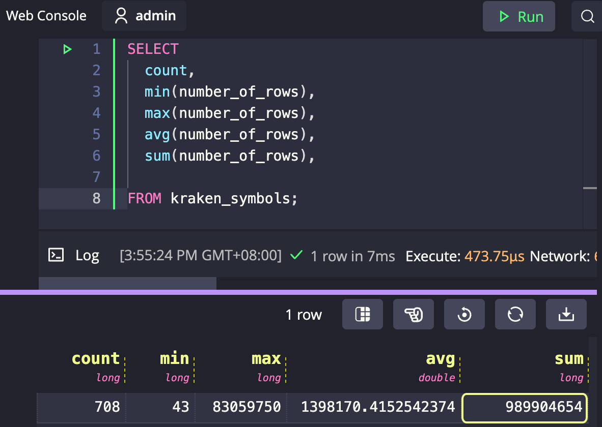

# Fluvio DeepCausality Example Project

## Overview
 
This project is a simple example of how to use Fluvio and DeepCausality to build 
a real-time causal inference pipeline. Specifically, the project illustrates:

1) How to replay and resample trade data.
2) How to stream SBE Encoded data using Fluvio's message system.
3) How to do causal inference on real-time data streams with DeepCausality. 

### 👉 **Fluvio**

Fluvio is an open-source data streaming platform with in-flight computation capabilities to aggregate, correlate, and
transform data records in real-time as they move through the network. Read more on
the [Fluvio website](https://www.fluvio.io).

### 👉 **DeepCausality**

DeepCausality is a hyper-geometric computational causality library that enables fast and deterministic context-aware
reasoning over complex multi-stage causality models. Deep Causality adds only minimal overhead and thus is suitable for
real-time applications. Read more on the [DeepCausality website](https://www.deepcausality.com).

### 👉 **QuestDB**

QuestDB is an open-source high performance time series database with enhanced SQL analytics for time series data. Read
more on the [QuestDB website](https://questdb.io).

### 👉 **SBE: Simple Binary Encoding**

Simple Binary Encoding is a highly efficient fixed sized binary codec used for  message encoding & decoding. Read more on the [SBE GitHub repo](https://github.com/real-logic/simple-binary-encoding) and on the [FIX community standard page](https://www.fixtrading.org/standards/sbe/). Note, the SBE Rust bindings are generated with the [official SBE tool.](https://github.com/real-logic/simple-binary-encoding/wiki/Sbe-Tool-Guide)

## 🚀 Get started

1. Clone this repo: ```git clone https://github.com/marvin-hansen/fluvio-examples.git```
2. Install all requirements ([installation guide](doc/install.md)) and import test data ([import guide](doc/import_data.md)).
3. Start the QD gateway and run the example code. 


## 📚 Docs

* [Installation](doc/install.md)
* [Data import](doc/import_data.md)
* [Data analysis with SQL](doc/analyze_data.md)
* [QD communication protocol](doc/qd_protocol.md)

Generate the API documentation with:

```bash 
    make doc
```

This builds and opens the api documentation in your browser. Most crates have its  methods documented. The components
usually have code examples in the docs. If you find an error or missing documentation, please fill an issue or submit a PR.

## 📦 Installation

See the [installation guide ](doc/install.md)for detailed instructions.

## ⭐ Import Data

Please first download either the full or the quarterly trade tick data from the Kraken exchange. See
the [import data guide](doc/import_data.md) for detailed instructions. Make sure the unzipped data folder is in
the [data folder.](data) *and* the absolute path to
the data folder is set in the [import_data.toml config file](import_config.toml). This is crucial to make the data
import work. To start the data import, run in a terminal:

```bash
make import
```

Depending on the machine, and the selected dataset, this may take a while.

**IMPORTANT:** 

The data importer generates symbol id's on the fly to map symbol names to symbol id, 
which means when you import data, **_your symbol mapping most likely will differ from the example code_**.

For example, when XBTEUR maps to 202 in the examples, you will almost certainly see a different number 
on your system after the data import.  

## 🔥 Analyze data with SQL

After the import has completed, you can inspect the data was imported by opening the SQL console in your browser:

http://localhost:7777/

All SQL queries are stored in the [sql folder.](sql) Let's summarize the imported data by running the following query:

```
SELECT 
  count,
  min(number_of_rows),
  max(number_of_rows),
  avg(number_of_rows), 
  sum(number_of_rows),

FROM kraken_symbols;
```

Which should result in the following output for the complete dataset:



That means, we have imported all markets into 708 tables with a total of 989_904_654 rows of data into QuestDB.

For more details on how to analyze the data, please see the following guide:

* [Data analysis with SQL](doc/analyze_data.md)


## 🚀 Start the Quant Data Gateway (QDGW)

Please ensure that:

1) Fluvio is up and running
2) QuestDB is up and running
3) Tick data are imported
   Optional: Start autometrics:

Run in a dedicated terminal:

```bash
    make qdgw
```

which should show:

``` 
    ||  QDGW  ||
    ==========================================
    Listening on TOPIC: qdgw-control
    Metrics on endpoint: 0.0.0.0:8080/metrics
    ==========================================
```

When you want to shut down the QDGW, just press `ctrl+c`, which then
gracefully shutdowns the gateway.

## 🚀 Start the Symbol Master Database Service (SYMDB)

Please ensure that:

1) Fluvio is up and running
2) QuestDB is up and running
3) QDGW starts without any error

Run in another dedicated terminal:

```bash
    make symdb
```

which should show:

``` 
    ||  QDGW  ||
    ==========================================
    Listening on TOPIC: qdgw-control
    Metrics on endpoint: 0.0.0.0:8080/metrics
    ==========================================
```

## ⚙️ Run the example client 

Run in a dedicated terminal:

```bash
    make example
```

which will show:

``` 
-----------------------------------------
Select the number of the example to run:
-----------------------------------------
1) base: Basic Data Stream Example. Requires QDGW running
2) causal: Real-Time Causal Inference Example. Requires QDGW running
3) Symbol Master Example. Requires QDGW and SYMDB running
4) quit: Exit
-----------------------------------------

1) base
2) causal
3) symbol
4) qui
#?
```

Just type 1 for the base example, and press enter, to start the data streaming from the gateway to the sample client. 

```
Running `target/release/basic_data_stream`
basic_data_stream/main: Starting client: QDClient
basic_data_stream/main: Start streaming trade data for ETH/AED with symbol id: 278
basic_data_stream/main: Wait a moment to let stream complete...
FirstTradeBar { message_type: FirstTradeBar, symbol_id: 278 }
TradeBar { symbol_id: 278, date_time: 2022-08-09T11:34:47Z, price: 6306.1, volume: 0.00231 }
TradeBar { symbol_id: 278, date_time: 2022-08-09T11:36:11Z, price: 6313.5, volume: 0.00078025 }
...
LastTradeBar { message_type: LastTradeBar, symbol_id: 278 }
basic_data_stream/main: Start streaming 5 MIN OHLCV data for ETH/AED
basic_data_stream/main: Wait a moment to let stream complete...
FirstOHLCVBar { message_type: FirstOHLCVBar, symbol_id: 278 }
OHLCVBar { symbol_id: 278, date_time: 2022-08-09T11:30:00Z, open: 6306.1, high: 6306.1, low: 6306.1, close: 6306.1, volume: 0.00231 }
OHLCVBar { symbol_id: 278, date_time: 2022-08-09T11:35:00Z, open: 6313.5, high: 6313.5, low: 6298.6, close: 6302.4, volume: 0.00533591 }
```

## Optional: Start Autometrics

Autometrics is an observability micro-framework that makes it easy to instrument any function with the most useful metrics: request rate, error rate, and latency.

Run in a dedicated terminal to start autometrics:

```bash
    am start :8080
```

which should show:

``` 
am start :8080
Checking if provided metrics endpoints work...
Now sampling the following endpoints for metrics: http://localhost:8080/metrics
Using Prometheus version: 2.47.2
Starting prometheus

  am v0.6.0   press ctrl + c to shutdown

  Explorer         http://127.0.0.1:6789
  Prometheus       http://127.0.0.1:9090/prometheus
```

It is important to start the gateway first, and autometrics second, otherwise autometrics fails to connect to the metrics endpoint and will not collect data. If that ever happens, just shhut down autometrics with `ctrl+c`, ensure that the gateway
is running, and
start autometrics on port 8080.


You can now navigate to http://localhost:6789 to see the autometrics explorer.

The autometrics dashboard shows by default the top five endpoints by the number of requests. As you run the example code, the number of requests will increase over time, as shown in the plot below. You can inspect more detailed metrics for each function in the function tab.


Note, if you already have a prometheus installation or simply don't want metrics, the QDGW works perfectly fine without autometrics.


## ✨ Symbol Mapping

Because the dataset contains so many symbols (695) and the message bus relies entirely on
binary encoding, we need to map textual symbols to their numeric IDs.

The symbol manager provides methods to convert symbols and numeric IDs back
and forth, which helps to implement clients efficiently.

For more details on the symbol mapping and how to query the DB,
please see the following guide:

* [Symbol mapping](doc/symbol_mapping.md)

## 🛠️ Make

Make sure all cargo tools are installed, as described in the [installation guide](doc/install.md). After all tools have been installed, the following commands are ready to use.
```
make
    make qdgw   	Start the Start the Quant Data Gateway (QDGW).
    make symdb   	Start the Symbol Master Database Service (SYMDB)
    make example    Run the example code in flv_examples.
    make build   	Builds the code base incrementally (fast) for dev.
    make check   	Checks the code base for security vulnerabilities.
    make doc   		Builds, tests, and opens api docs in a browser.
    make fix   		Fixes linting issues as reported by clippy.
    make import   	Imports tick data from CSV into QuestDB.
    make format   	Formats call code according to cargo fmt style.
    make setup   	Tests and installs all make script dependencies.
    make run   		Runs the default binary (QDGW).
    make update   	Update rust, update and build the project.
    make test   	Tests across all crates.
    make sbe   		Generates Rust bindings from the SBE schema.
```

The scripts called by each make command are located in the [script folder.](scripts)

## 📜 Licence

This project is licensed under the Apache Licence.
See the [LICENSE](LICENSE) file for details.

## 🙏 Acknowledgment

The author expresses his gratitude to the [infinyon team](https://infinyon.com/about/#) behind
the [Fluvio platform](https://fluvio.io/).

## 💻 Author

* [Marvin Hansen](https://github.com/marvin-hansen)
* Github GPG key ID: 369D5A0B210D39BC
* GPG Fingerprint: 4B18 F7B2 04B9 7A72 967E 663E 369D 5A0B 210D 39BC
