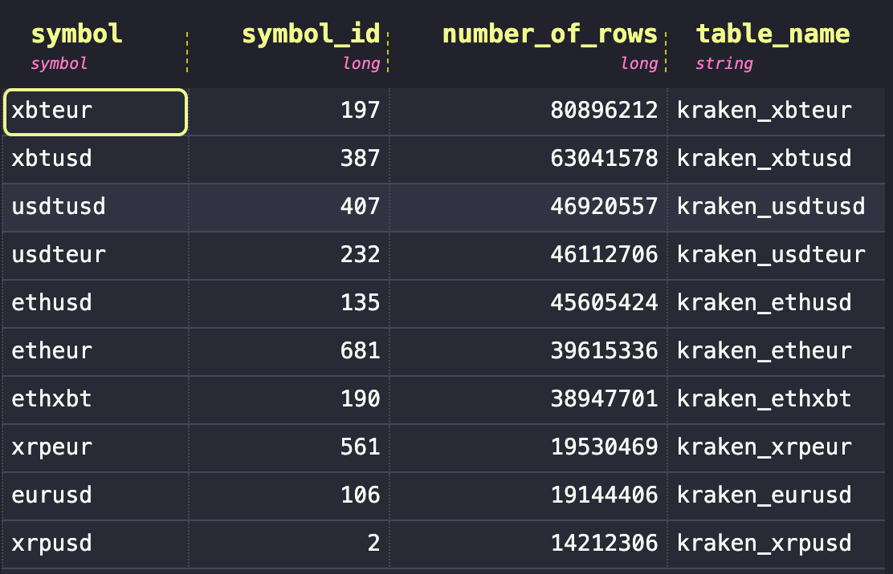
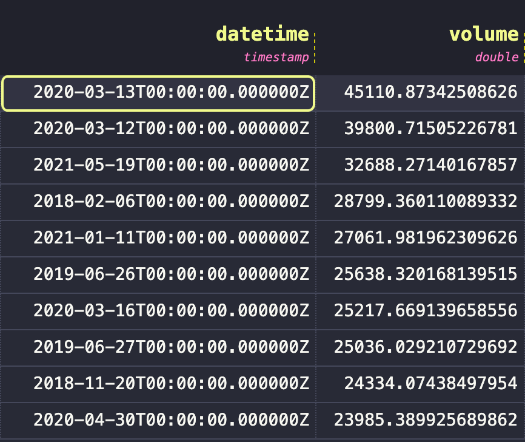
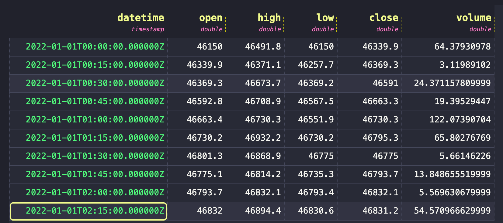

# Analyze data with SQL

## Top Ten Most Traded Markets

Let's see the top ten most traded markets of all time on Kraken:

```
SELECT * 
FROM kraken_symbols
ORDER BY number_of_rows ASC
LIMIT 10;
```
Unsurprisingly, Bitcoin (XBT) and Ethereum (ETH) dominate the top ten most traded markets. To see Ripple (XRP) in the top ten is more surprising given its rocky history of legal disputes.



## Top Ten Bitcoin Trading Days by Volume (USD)

Let's see the top ten trading days by volume (USD) for Bitcoin (XBT):

```
SELECT 
  timestamp datetime,
  sum(volume) volume,

FROM kraken_xbtusd

SAMPLE BY 1d
ALIGN TO CALENDAR WITH OFFSET '00:00'
ORDER BY volume DESC
limit 10;
```

Apparently, March madness applies to bitcoin as well. The top ten trading days by volume (USD) for Bitcoin (XBT) are:




## Resample Trades to 15min Bars

Let's resample the raw bitcoin trade data from 2022 into 15 minute bars.
For unknown reasons, the resampling leads to a one second shift that needs to be adjusted by starting sampling at exactly midnight. To do so, we use the align to calender expression followed by an offset in the 24h format.

```
SELECT
  timestamp datetime,
  first(price) open,
  max(price) high,
  min(price) low,
  last(price) close,
  sum(volume) volume,

FROM kraken_xbtusd
WHERE timestamp IN '2022'
SAMPLE BY 15m
ALIGN TO CALENDAR WITH OFFSET '00:00';
```

