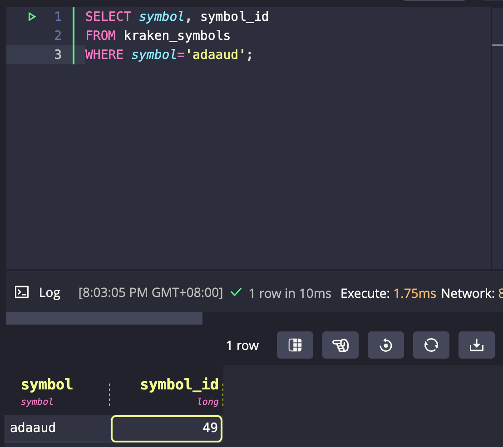

# Mapping Symbols

Because the dataset contains so many symbols and the message bus relies on
binary encoding, we need to map textual symbols to their numeric IDs.

The import tool already generated numeric ids for each symbol and for good reason because
most of the conversion between test symbols and numeric IDs happens
automatically behind the scenes. Please note, the symbol to id mapping is generated once during import 
and is stored in the database without any updates.

The symbol manager provides methods to convert symbols and numeric IDs back
and forth, which helps to implement clients efficiently.

## Map ID to Symbol

If you want to figure out the which symbol corresponds to a certain ID, or the other way around, you can query
the database. Suppose you  want to know which symbol belongs to ID 42:

```
SELECT symbol, symbol_id 
FROM kraken_symbols
WHERE symbol_id=42;
```


Now we know that ID 42 corresponds to the Energy Web (EWT) quoted in EUR.
By convention, the first currency within a currency pair is called the base, while the second currency is called the quote.

## Map ID to Symbol

Conversely, when you want to know the ID corresponding to the symbol pair "ADAAUD", you can query the database:

```
SELECT symbol, symbol_id 
FROM kraken_symbols
WHERE symbol='adaaud';
```


As you see, the symbol pair "ADAAUD" (ADA / Cardano, quoted in Australian Dollars AUD) corresponds to ID 49.
